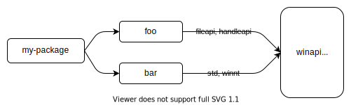

# Features

Cargo 的“feature”提供了一种表达[条件编译]与
[可选依赖](#optional-dependencies)的机制。一个 package 在 `Cargo.toml`
的 `[features]` 表中定义一组具名 feature，每个 feature 可以启用或禁用。
对当前正在构建的 package，可通过命令行参数（如 `--features`）启用其 feature。
对依赖的 feature，则可以在 `Cargo.toml` 的依赖声明中启用。

> **注意**：发布到 crates.io 的新 crate 或新版本，目前最多只能包含 300 个 feature。
> 超额需要按个案申请例外。详情见这篇[博客]，也欢迎在 crates.io 的 Zulip stream
> 参与方案讨论。

[blog post]: https://blog.rust-lang.org/2023/10/26/broken-badges-and-23k-keywords.html

另见 [Features Examples] 章节，其中给出了一些 feature 的使用示例。

[conditional compilation]: ../../reference/conditional-compilation.md
[Features Examples]: features-examples.md

## `[features]` 段

feature 在 `Cargo.toml` 的 `[features]` 表中定义。每个 feature
指定一个数组，数组项可以是其他 feature，或会被启用的可选依赖。
下面示例展示了在 2D 图像处理库中，如何可选支持不同图像格式：

```toml
[features]
# Defines a feature named `webp` that does not enable any other features.
webp = []
```

定义后，就可以通过 [`cfg` 表达式] 在编译期有条件地包含支持该 feature 的代码。
例如 package 的 `lib.rs` 可以包含：

```rust
// This conditionally includes a module which implements WEBP support.
#[cfg(feature = "webp")]
pub mod webp;
```

Cargo 会通过 rustc 的 [`--cfg` flag] 为 package 设置 feature，代码可使用
[`cfg` attribute] 或 [`cfg` macro] 检测这些 feature 是否存在。

feature 也可以列出需要同时启用的其他 feature。例如 ICO 图像格式可以内嵌
BMP 和 PNG，因此启用 ICO 时也应启用这两个 feature：

```toml
[features]
bmp = []
png = []
ico = ["bmp", "png"]
webp = []
```

feature 名称可使用 [Unicode XID standard] 中的字符（包含绝大多数字母），
并额外允许以下规则：首字符可为 `_` 或数字 `0` 到 `9`，首字符之后还可包含
`-`、`+`、`.`。

> **注意**：[crates.io] 对 feature 名还有额外限制：
> 只能使用 [ASCII alphanumeric] 字符或 `_`、`-`、`+`。

[crates.io]: https://crates.io/
[Unicode XID standard]: https://unicode.org/reports/tr31/
[ASCII alphanumeric]: ../../std/primitive.char.html#method.is_ascii_alphanumeric
[`--cfg` flag]: ../../rustc/command-line-arguments.md#option-cfg
[`cfg` expressions]: ../../reference/conditional-compilation.md
[`cfg` attribute]: ../../reference/conditional-compilation.md#the-cfg-attribute
[`cfg` macro]: ../../std/macro.cfg.html

## `default` feature

默认情况下，所有 feature 都是关闭的，除非显式启用。
可以通过指定 `default` feature 改变这一点：

```toml
[features]
default = ["ico", "webp"]
bmp = []
png = []
ico = ["bmp", "png"]
webp = []
```

构建 package 时会启用 `default`，进而启用其中列出的 feature。
此行为可通过以下方式调整：

* `--no-default-features` [命令行参数](#command-line-feature-options)
  会禁用该 package 的默认 feature。
* 在[依赖声明](#dependency-features)中指定 `default-features = false`。

> **注意**：选择默认 feature 集时要谨慎。默认 feature 的优势是易用，
> 用户无需逐个挑选常见场景所需 feature。但它也有代价：依赖会默认启用
> 默认 feature（除非声明了 `default-features = false`）。这会让“确保默认
> feature 未被启用”变得困难，尤其在依赖图中同一个依赖多次出现时。
> 若要避免启用默认 feature，依赖链上的每个 package 都必须显式指定
> `default-features = false`。
>
> 另一个问题是：从默认集合中移除一个 feature 可能构成
> [SemVer 不兼容变更](#semver-compatibility)，所以只有在你确认会长期保留
> 这些 feature 时才应将其放入默认集合。

## Optional dependencies

依赖可以标记为“optional”，即默认不会被编译。
例如一个 2D 图像处理库依赖外部 package 处理 GIF，可写成：

```toml
[dependencies]
gif = { version = "0.11.1", optional = true }
```

默认情况下，这个可选依赖会隐式定义一个同名 feature，等价于：

```toml
[features]
gif = ["dep:gif"]
```

这表示只有启用 `gif` feature 时，`gif` 依赖才会被包含。
代码中可同样使用 `cfg(feature = "gif")`，并可像普通 feature 一样通过
`--features gif` 启用（见下文[命令行 feature 选项](#command-line-feature-options)）。

有些场景下你不希望暴露与可选依赖同名的 feature。
例如该可选依赖只是内部实现细节，或你想把多个可选依赖打包成一个 feature，
又或者你希望用更好的名称。
当你在 `[features]` 表中任何位置使用 `dep:` 前缀引用该可选依赖时，
对应的隐式 feature 就会被禁用。

> **注意**：`dep:` 语法从 Rust 1.60 开始可用。
> 更早版本只能使用隐式 feature 名称。

例如，为支持 AVIF 格式，库需要同时启用两个依赖：

```toml
[dependencies]
ravif = { version = "0.6.3", optional = true }
rgb = { version = "0.8.25", optional = true }

[features]
avif = ["dep:ravif", "dep:rgb"]
```

在这个例子里，`avif` feature 会启用上面两个依赖。
同时由于我们显式使用了 `dep:`，就不会再创建隐式 `ravif` / `rgb` feature。
这通常符合预期，因为这两个依赖只是 crate 的内部细节，不希望用户单独启用。

> **注意**：另一种“可选引入依赖”的方法是使用
> [platform-specific dependencies]。与 feature 不同，
> 它们按目标平台条件生效。

[platform-specific dependencies]: specifying-dependencies.md#platform-specific-dependencies

## Dependency features

可以在依赖声明中启用依赖自己的 feature。`features` 键用于指定要启用的 feature：

```toml
[dependencies]
# Enables the `derive` feature of serde.
serde = { version = "1.0.118", features = ["derive"] }
```

也可以通过 `default-features = false` 禁用依赖的
[`default` features](#the-default-feature)：

```toml
[dependencies]
flate2 = { version = "1.0.3", default-features = false, features = ["zlib-rs"] }
```

> **注意**：这不一定能保证默认 feature 真正被禁用。
> 如果另一个依赖在引入 `flate2` 时没有写 `default-features = false`，
> 那默认 feature 仍会被启用。详见下文 [feature
> unification](#feature-unification)。

还可以在 `[features]` 表中启用依赖 feature，语法是
`"package-name/feature-name"`。例如：

```toml
[dependencies]
jpeg-decoder = { version = "0.1.20", default-features = false }

[features]
# Enables parallel processing support by enabling the "rayon" feature of jpeg-decoder.
parallel = ["jpeg-decoder/rayon"]
```

`"package-name/feature-name"` 语法还会在 `package-name` 是可选依赖时
顺带启用它本身，这往往不是你想要的。
你可以写成 `"package-name?/feature-name"`，这样只有“当别处已启用该可选依赖”时，
才启用对应 feature。

> **注意**：`?` 语法从 Rust 1.60 开始可用。

例如，库增加了序列化支持，需要联动启用某些可选依赖的对应 feature：

```toml
[dependencies]
serde = { version = "1.0.133", optional = true }
rgb = { version = "0.8.25", optional = true }

[features]
serde = ["dep:serde", "rgb?/serde"]
```

在该例中，启用 `serde` feature 会启用 `serde` 依赖；
同时还会启用 `rgb` 依赖的 `serde` feature，但前提是有其他地方已经启用了 `rgb`。

## 命令行 feature 选项

以下命令行参数可用于控制启用哪些 feature：

* `--features` _FEATURES_：启用列出的 feature。多个 feature
  可用逗号或空格分隔。如果使用空格且从 shell 调用 Cargo，
  记得加引号（如 `--features "foo bar"`）。在 [workspace] 中一次构建多个
  package 时，可用 `package-name/feature-name` 为特定 workspace 成员启用 feature。
* `--all-features`：为命令行选中的所有 package 启用全部 feature。
* `--no-default-features`：不启用已选 package 的 [`default`
  feature](#the-default-feature)。

**注意**：请查看具体子命令文档。并非所有子命令都支持全部参数。

[workspace]: workspaces.md

## Feature unification

feature 只属于定义它的那个 package。
在某 package 上启用某个 feature，并不会让其他 package 的同名 feature 自动启用。

当一个依赖被多个 package 使用时，Cargo 在构建该依赖时会采用“已启用 feature 的并集”。
这有助于保证只使用该依赖的一份构建结果。详见 resolver 文档中的
[features section]。

例如 [`winapi`] 这个 package 使用了[大量][winapi-features] feature。
如果你的 package 依赖 `foo`（启用了 `winapi` 的 `fileapi` / `handleapi`），
又依赖 `bar`（启用了 `winapi` 的 `std` / `winnt`），
那么最终 `winapi` 会以这四个 feature 全部启用的状态构建。



[`winapi`]: https://crates.io/crates/winapi
[winapi-features]: https://github.com/retep998/winapi-rs/blob/0.3.9/Cargo.toml#L25-L431

这带来的结果是：feature 应该是*可叠加（additive）*的。
也就是说，启用某个 feature 不应关闭功能；通常任意组合都应安全。
feature 不应引入 [SemVer 不兼容变更](#semver-compatibility)。

例如，如果你想“可选支持 [`no_std`] 环境”，**不要**使用 `no_std` feature。
应改为定义一个会*启用* `std` 的 `std` feature。示例：

```rust
#![no_std]

#[cfg(feature = "std")]
extern crate std;

#[cfg(feature = "std")]
pub fn function_that_requires_std() {
    // ...
}
```

[`no_std`]: ../../reference/names/preludes.html#the-no_std-attribute
[features section]: resolver.md#features

### 互斥 feature

少数情况下，feature 之间可能互不兼容。
应尽量避免这种设计，因为它要求依赖图中该 package 的所有使用方共同协调，
防止把互斥 feature 一起启用。
如果确实无法避免，可考虑添加编译错误检测。示例：

```rust,ignore
#[cfg(all(feature = "foo", feature = "bar"))]
compile_error!("feature \"foo\" and feature \"bar\" cannot be enabled at the same time");
```

相比互斥 feature，可考虑以下方案：

* 把功能拆分到不同 package。
* 出现冲突时，[选择某个 feature 优先][feature-precedence]。
  [`cfg-if`] crate 可帮助书写更复杂的 `cfg` 表达式。
* 在架构层面允许 feature 并行启用，再通过运行时选项控制使用哪种行为。
  例如配置文件、命令行参数或环境变量。

[`cfg-if`]: https://crates.io/crates/cfg-if
[feature-precedence]: features-examples.md#feature-precedence

### 检查已解析的 feature

在复杂依赖图中，理解“各 package 的 feature 是如何被启用的”可能比较困难。
[`cargo tree`] 命令提供了多个选项，帮助检查与可视化 feature：

* `cargo tree -e features`：显示依赖图中的 feature，
  每个 feature 会显示由哪个 package 启用。
* `cargo tree -f "{p} {f}"`：更紧凑的视图，展示每个 package
  启用 feature 的逗号分隔列表。
* `cargo tree -e features -i foo`：反转树，展示 feature 如何流入 `foo`。
  这在全图过大难以阅读时很有帮助，适用于定位“某个 package 的 feature
  为什么会被启用”。如何阅读可参考 [`cargo tree`] 页面底部示例。

[`cargo tree`]: ../commands/cargo-tree.md

## Feature resolver version 2

可通过 `Cargo.toml` 中的 `resolver` 字段指定不同的 feature 解析器：

```toml
[package]
name = "my-package"
version = "1.0.0"
resolver = "2"
```

更多说明见 [resolver versions]。

`"2"` 版解析器会避免在某些场景下进行 feature 合并（这些场景下合并并不理想）。
完整规则见 [resolver chapter][resolver-v2]。简要来说，它会避免在以下情况合并：

* 对当前未构建目标架构启用的[平台特定依赖] feature 会被忽略。
* [Build-dependencies] 与 proc-macro 不再和普通依赖共享 feature。
* [Dev-dependencies] 只有在构建确实需要它们的 [Cargo target][target]
  （如测试或示例）时才会激活 feature。

避免合并在某些场景是必须的。例如某个 build-dependency 启用了 `std`，
而同一依赖在普通依赖路径中用于 `no_std`，那 `std` 被合并进来会导致构建失败。

但缺点是构建时间可能增加，因为同一依赖会按不同 feature 被构建多次。
使用 `"2"` 版解析器时，建议检查是否存在“同一依赖被重复构建”的情况，
以降低整体构建时间。
如果并不*需要*将这些重复 package 用不同 feature 分开构建，
可在[依赖声明](#dependency-features)的 `features` 列表里补齐相同 feature，
让重复项最终特征一致（这样 Cargo 就只构建一次）。
可通过 [`cargo tree --duplicates`][`cargo tree`] 发现重复依赖：
它会显示哪些 package 被构建多次；重点查看同版本重复条目。
关于如何查看已解析 feature 的更多信息，见
[Inspecting resolved features](#inspecting-resolved-features)。
对于 build-dependency，如果你在交叉编译时使用 `--target`，
则不需要做这一步，因为该场景下 build-dependency 本就始终与普通依赖分开构建。

[target]: ../appendix/glossary.md#target

### Resolver version 2 的命令行参数行为

`resolver = "2"` 还会改变 `--features` 和 `--no-default-features`
[命令行选项](#command-line-feature-options)的行为。

在版本 `"1"` 中，只能为“当前工作目录对应 package”启用 feature。
例如 workspace 有 `foo` 和 `bar` 两个 package，当前位于 `foo` 目录，执行
`cargo build -p bar --features bar-feat` 会失败，因为 `--features`
当时只能作用于 `foo`。

使用 `resolver = "2"` 后，feature 参数可为命令行通过 `-p` 与 `--workspace`
选中的任意 package 启用 feature。例如：

```sh
# This command is allowed with resolver = "2", regardless of which directory
# you are in.
cargo build -p foo -p bar --features foo-feat,bar-feat

# This explicit equivalent works with any resolver version:
cargo build -p foo -p bar --features foo/foo-feat,bar/bar-feat
```

此外，在 `resolver = "1"` 中，`--no-default-features` 只会禁用当前目录 package
的默认 feature；在版本 `"2"` 中，它会禁用所有 workspace 成员的默认 feature。

[resolver versions]: resolver.md#resolver-versions
[build-dependencies]: specifying-dependencies.md#build-dependencies
[dev-dependencies]: specifying-dependencies.md#development-dependencies
[resolver-v2]: resolver.md#feature-resolver-version-2

## Build scripts

[Build scripts] 可以通过读取 `CARGO_FEATURE_<name>` 环境变量，
检测当前 package 启用了哪些 feature。其中 `<name>` 会被转成大写，
并将 `-` 转为 `_`。

[build scripts]: build-scripts.md

## Required features

可使用 [`required-features` field] 在某个 feature 未启用时禁用特定
[Cargo targets]。详见对应文档。

[`required-features` field]: cargo-targets.md#the-required-features-field
[Cargo targets]: cargo-targets.md

## SemVer compatibility

启用 feature 不应引入 SemVer 不兼容变更。
例如，不应以可能破坏现有用法的方式修改已有 API。
哪些改动是兼容的，可见 [SemVer Compatibility 章节](semver.md)。

新增或删除 feature 定义与可选依赖时要谨慎，这些操作有时会造成向后不兼容。
详见 SemVer Compatibility 章节中的 [Cargo 小节](semver.md#cargo)。
简要规则如下：

* 以下操作在次版本发布中通常是安全的：
  * 新增[feature][cargo-feature-add]或[可选依赖][cargo-dep-add]。
  * [修改依赖上启用的 feature][cargo-change-dep-feature]。
* 以下操作在次版本发布中通常**不应**执行：
  * 删除[feature][cargo-feature-remove]或[可选依赖][cargo-remove-opt-dep]。
  * [把现有公开代码移到 feature 后面][item-remove]。
  * [从 feature 列表中移除某个 feature][cargo-feature-remove-another]。

具体注意点与示例见各链接。

[cargo-change-dep-feature]: semver.md#cargo-change-dep-feature
[cargo-dep-add]: semver.md#cargo-dep-add
[cargo-feature-add]: semver.md#cargo-feature-add
[item-remove]: semver.md#item-remove
[cargo-feature-remove]: semver.md#cargo-feature-remove
[cargo-remove-opt-dep]: semver.md#cargo-remove-opt-dep
[cargo-feature-remove-another]: semver.md#cargo-feature-remove-another

## Feature 文档与发现

建议你在 package 中清晰记录可用 feature。
可在 `lib.rs` 顶部增加[文档注释][doc comments]实现。
例如可参考 [regex crate source]（渲染后可在 [docs.rs][regex-docs-rs] 查看）。
如果你还有用户指南等文档，也建议在那里记录（例如 [serde.rs]）。
若是二进制项目，可在 README 或其他项目文档记录 feature（例如 [sccache]）。

清晰记录 feature 也有助于说明哪些 feature 是“实验性/不稳定”或不建议直接使用。
例如某可选依赖存在，但你不希望用户显式把它当 feature 使用，
就应把它排除在文档列出的 feature 清单之外。

发布到 [docs.rs] 的文档可以使用 `Cargo.toml` 中的元数据控制
“构建文档时启用哪些 feature”。详见 [docs.rs metadata documentation]。

> **注意**：Rustdoc 对“在文档中标注某 API 需要哪些 feature”有实验性支持。
> 详见 `doc_cfg` 文档。示例可看 [`syn` documentation]，
> 其中会以彩色标记框提示所需 feature。

[docs.rs metadata documentation]: https://docs.rs/about/metadata
[docs.rs]: https://docs.rs/
[serde.rs]: https://serde.rs/feature-flags.html
[doc comments]: ../../rustdoc/how-to-write-documentation.html
[regex crate source]: https://github.com/rust-lang/regex/blob/1.4.2/src/lib.rs#L488-L583
[regex-docs-rs]: https://docs.rs/regex/1.4.2/regex/#crate-features
[sccache]: https://github.com/mozilla/sccache/blob/0.2.13/README.md#build-requirements
[`syn` documentation]: https://docs.rs/syn/1.0.54/syn/#modules

### Discovering features

当 feature 在库 API 文档里被清晰标注时，用户更容易发现有哪些 feature 以及各自用途。
如果某 package 的 feature 文档不易找到，你可以直接查看 `Cargo.toml`，
但有时源码位置并不直观。[crates.io] 上的 crate 页面通常会给出源码仓库链接。
也可以使用 [`cargo vendor`] 或 [cargo-clone-crate] 下载源码并检查。

[`cargo vendor`]: ../commands/cargo-vendor.md
[cargo-clone-crate]: https://crates.io/crates/cargo-clone-crate

## Feature combinations

由于 feature 本质上是条件编译的一种形式，要 100% 覆盖所有配置与测试用例，
组合数量会呈指数增长。默认情况下，测试、文档和诸如
[Clippy](https://github.com/rust-lang/rust-clippy) 之类的工具，
通常只会在“默认 feature 集”下运行。

建议你根据项目实际情况制定 feature 组合策略与工具链方案。
不同项目在时间、资源、以及覆盖特定场景的成本收益上差异很大。
常见做法包括：测试“启用/禁用默认 feature”，测试若干特定 feature 组合，
或测试全部组合。
