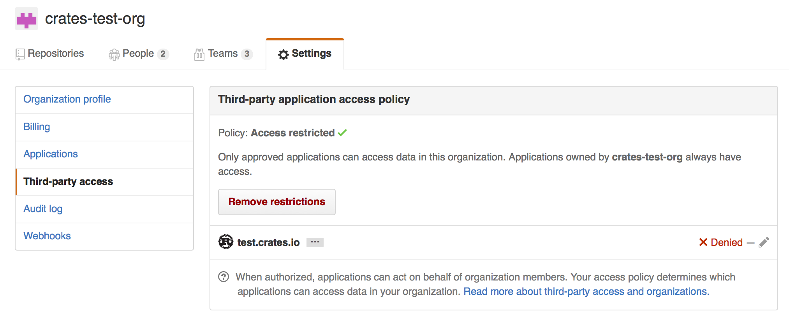
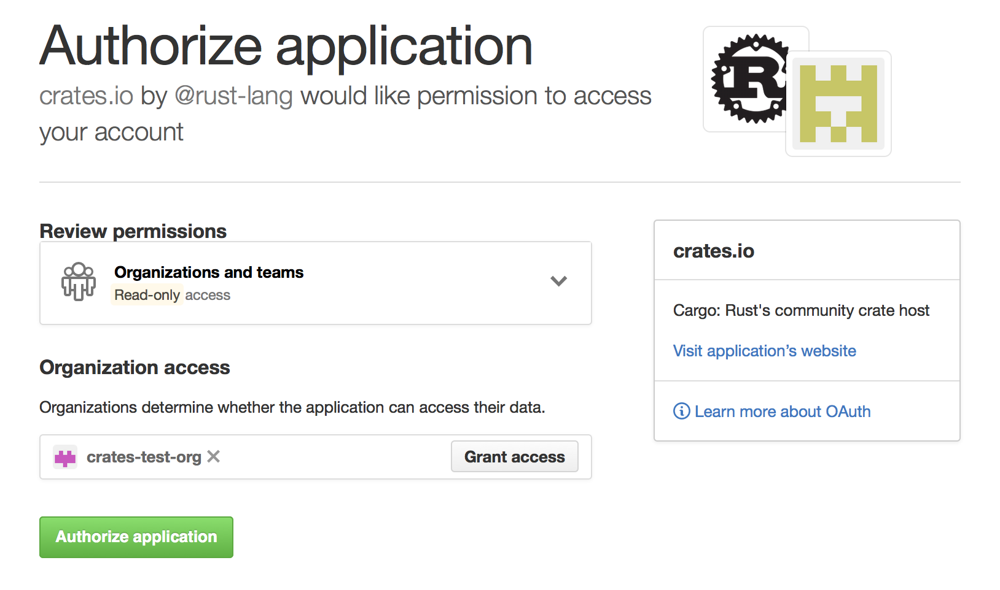

# 在 crates.io 上发布

当你有了想分享给大家的库，就可以把它发布到 [crates.io]。
发布 crate 指的是把某个特定版本上传并托管到 [crates.io]。

发布时请务必谨慎，因为发布是**永久**的：
该版本不能被覆盖，代码也不能删除。
不过可发布的版本数量没有上限。

## 首次发布前

首先，你需要一个 [crates.io] 账号来获取 API token。
前往[首页][crates.io]，使用 GitHub 账号登录（目前仍要求）。
你还需要在 [Account Settings](https://crates.io/settings/profile)
填写并验证邮箱地址。
完成后，在 [create an API token](https://crates.io/settings/tokens) 页面创建 token，
并务必复制保存，因为离开页面后将无法再次查看。

然后执行 [`cargo login`]：

```console
$ cargo login
```

根据提示粘贴 token：
```console
please paste the API Token found on https://crates.io/me below
abcdefghijklmnopqrstuvwxyz012345
```

该命令会把 API token 保存到本地 `~/.cargo/credentials.toml`。
注意 token 属于**敏感凭据**，不要泄露。
若发生泄露，应立即吊销。

> **注意**：可使用 [`cargo logout`] 从 `credentials.toml` 删除 token。
> 如果你不再需要本机保存该 token，这会很有用。

## 发布新 crate 前

请记住， [crates.io] 上的 crate 名遵循先到先得。
一旦名称被占用，其他 crate 不能再使用该名称。

建议查看 `Cargo.toml` 中可配置的[元数据](manifest.md)，
让你的 crate 更容易被发现。
发布前建议至少填写：

- [`license` or `license-file`]
- [`description`]
- [`homepage`]
- [`repository`]
- [`readme`]

另外也建议填写 [`keywords`] 与 [`categories`]，虽非必填。

如果你发布的是库，也建议参考 [Rust API
Guidelines]。

### 打包 crate

下一步是打包并上传到 [crates.io]。
可使用 [`cargo publish`] 子命令。它会执行：

1. 对 package 做一些校验。
2. 将源码压缩为 `.crate` 文件。
3. 在临时目录解压 `.crate` 并验证可编译。
4. 上传 `.crate` 到 [crates.io]。
5. 注册表在入库前会再做额外检查。

推荐先执行 `cargo publish --dry-run`（或等价的 [`cargo
package`]），先确保没有警告或错误。
这会执行上面前 3 步。

```console
$ cargo publish --dry-run
```

你可以在 `target/package` 目录检查生成的 `.crate` 文件。
[crates.io] 目前对 `.crate` 文件大小限制为 10MB。
建议检查体积，避免把构建不需要的大文件打进去，
例如测试数据、网站文档、代码生成产物等。
可用下列命令查看会被打包的文件：

```console
$ cargo package --list
```

打包时 Cargo 会自动忽略版本控制系统已忽略的文件。
如需额外忽略文件，可在 manifest 中使用
[`exclude` key](manifest.md#the-exclude-and-include-fields)：

```toml
[package]
# ...
exclude = [
    "public/assets/*",
    "videos/*",
]
```

如果你更希望显式列出“要包含的文件”，
Cargo 也支持 [`include` key](manifest.md#the-exclude-and-include-fields)。
设置后会覆盖 `exclude`：

```toml
[package]
# ...
include = [
    "**/*.rs",
]
```

## 上传 crate

准备就绪后，执行 [`cargo publish`] 上传到 [crates.io]：

```console
$ cargo publish
```

就这样，你的第一个 crate 已经发布。

## 发布已有 crate 的新版本

要发布新版本，请修改 `Cargo.toml` 中[ `version` 字段](manifest.md#the-version-field)。
同时注意 [SemVer 规则](semver.md) 对兼容性变更的建议。
然后按上文执行 [`cargo publish`] 上传新版本。

> **建议：**把完整发布流程纳入考虑，并尽量自动化。
>
> 每个版本建议包含：
> - 一条变更日志，最好是[人工整理](https://keepachangelog.com/en/1.0.0/)
>   （自动生成也比没有好）
> - 指向已发布提交的 [git tag](https://git-scm.com/book/en/v2/Git-Basics-Tagging)
>
> 下列第三方工具代表了不同工作流（按字母序）：
> - [cargo-release](https://crates.io/crates/cargo-release)
> - [cargo-smart-release](https://crates.io/crates/cargo-smart-release)
> - [release-plz](https://crates.io/crates/release-plz)
>
> 更多可见 [crates.io](https://crates.io/search?q=cargo%20release)。

## 管理 crates.io 上的 crate

crate 的管理主要通过命令行 `cargo`，而不是 [crates.io] 网页界面。
可用的管理子命令有以下几个。

### `cargo yank`

有时你发布的某个版本实际是坏的（语法错误、漏文件等）。
这种情况下可以对某版本执行 “yank”。

```console
$ cargo yank --version 1.0.1
$ cargo yank --version 1.0.1 --undo
```

yank **不会** 删除任何代码。
例如如果误传了密钥，这个功能并不能帮你删除，
你必须立刻轮换/重置这些密钥。

yank 的语义是：
不能再创建指向该版本的新依赖，但已有依赖继续可用。
[crates.io] 的核心目标之一是作为“不会随时间变化的永久归档”。
允许删除版本与该目标冲突。
本质上，yank 能保证现有 `Cargo.lock` 不会被破坏，
但未来新生成的 `Cargo.lock` 不会再选择被 yank 的版本。

### `cargo owner`

一个 crate 往往由多人维护，主维护者也可能变化。
crate owner 是唯一可发布新版本的人，
但 owner 可以指定额外 owner。

```console
$ cargo owner --add github-handle
$ cargo owner --remove github-handle
$ cargo owner --add github:rust-lang:owners
$ cargo owner --remove github:rust-lang:owners
```

这些命令中的 owner ID 必须是 GitHub 用户名或 GitHub 团队。

若 `--add` 给的是用户名，该用户会被邀请为“named owner”，
拥有对 crate 的完整权限。
除了发布与 yank，还可增删 owner，
甚至可以移除把他加进来的 owner。
因此，不要把你不完全信任的人设为 named owner。
用户要成为 named owner，必须先登录过 [crates.io]。

若 `--add` 给的是团队名，该团队会被邀请为“team owner”，
权限受限：可以发布和 yank，但不能增删 owner。
对多人维护而言团队方式更方便，
并且在 owner 恶意行为方面通常更安全一些。

团队语法当前是 `github:org:team`（见上例）。
邀请团队为 owner 时，你必须是该团队成员。
移除团队 owner 则没有这个限制。

## GitHub 权限

GitHub 对“团队成员关系”并未提供简单公开访问，
因此你在相关操作时很可能看到如下信息：

> It looks like you don’t have permission to query a necessary property from
GitHub to complete this request. You may need to re-authenticate on [crates.io]
to grant permission to read GitHub org memberships.

这基本是“你查询了某个团队，但在五层访问控制中的某一层被拒绝”的兜底错误。
这不是夸张，GitHub 的团队访问控制是企业级复杂度。

最常见原因是：你上次登录时，这项功能还没上线。
早期 crates.io 登录时不会向 GitHub 请求权限，
因为当时只用 token 做登录，不做别的。
但现在为了代你查询团队成员关系，
需要 [the `read:org` scope][oauth-scopes]。

你可以拒绝这个 scope，且“团队 owner 功能引入前可用的能力”仍可继续使用。
但你将无法把团队添加为 owner，也无法以团队 owner 身份发布 crate。
若尝试这样做，就会看到上述错误。
如果你尝试发布一个你并不拥有的 crate，且它恰好有团队 owner，也可能遇到该错误。

若你改主意了，或不确定 [crates.io] 是否已有足够权限，
可随时访问 <https://crates.io/> 重新认证。
如果 scope 不全，系统会再次请求授权。

另一个障碍是：组织层面可能主动禁止第三方访问。
可在以下地址检查：

```text
https://github.com/organizations/:org/settings/oauth_application_policy
```

其中 `:org` 是组织名（如 `rust-lang`）。
你可能会看到类似：



你可以把 [crates.io] 从组织黑名单中移除，
或者直接点击 “Remove Restrictions”，允许所有第三方应用访问该数据。

另外，当 [crates.io] 请求 `read:org` scope 时，
你也可以在其名称旁点击 “Grant Access”，
显式允许 [crates.io] 查询该组织：



### 排查 GitHub 团队访问错误

当你尝试把 GitHub 团队添加为 crate owner 时，可能会看到：

```text
error: failed to invite owners to crate <crate_name>: api errors (status 200 OK): could not find the github team org/repo
```

这时应前往 [the GitHub Application settings page]，
检查 crates.io 是否出现在 `Authorized OAuth Apps` 标签页。
若不在，请先到 <https://crates.io/> 授权。
然后回到 GitHub 应用设置页，点击列表中的 crates.io 应用，
确认你或你的组织是否在 “Organization access” 列表中，且为绿色勾选状态。
如果有 `Grant` 或 `Request` 按钮，应执行授权，或请求组织 owner 授权。

[Rust API Guidelines]: https://rust-lang.github.io/api-guidelines/
[`cargo login`]: ../commands/cargo-login.md
[`cargo logout`]: ../commands/cargo-logout.md
[`cargo package`]: ../commands/cargo-package.md
[`cargo publish`]: ../commands/cargo-publish.md
[`categories`]: manifest.md#the-categories-field
[`description`]: manifest.md#the-description-field
[`documentation`]: manifest.md#the-documentation-field
[`homepage`]: manifest.md#the-homepage-field
[`keywords`]: manifest.md#the-keywords-field
[`license` or `license-file`]: manifest.md#the-license-and-license-file-fields
[`readme`]: manifest.md#the-readme-field
[`repository`]: manifest.md#the-repository-field
[crates.io]: https://crates.io/
[oauth-scopes]: https://developer.github.com/apps/building-oauth-apps/understanding-scopes-for-oauth-apps/
[the GitHub Application settings page]: https://github.com/settings/applications
