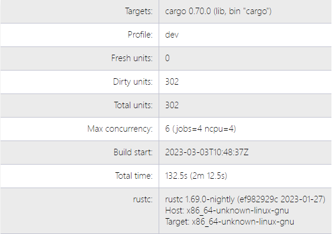
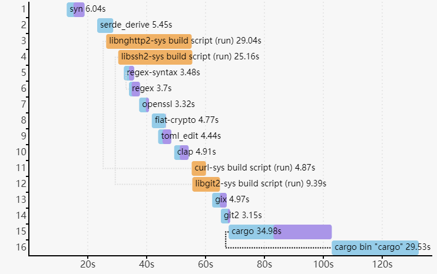
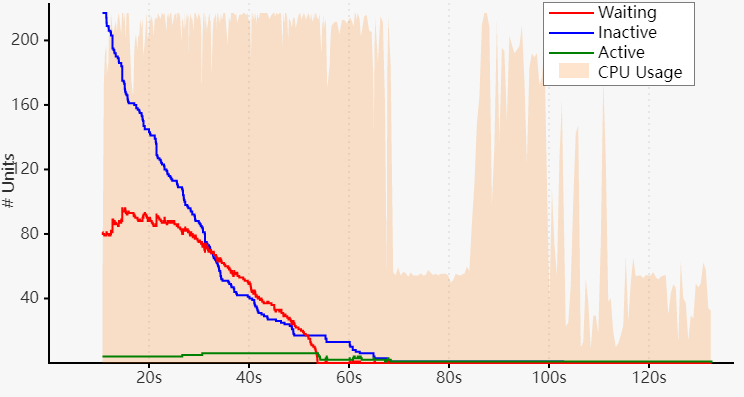

# 构建耗时报告
`--timings` 选项可展示每个编译步骤的耗时，并跟踪随时间变化的并发信息。

```sh
cargo build --timings
```

该命令会在 `target/cargo-timings/cargo-timing.html` 生成 HTML 报告。
同时还会在同目录生成一个带时间戳文件名的副本，便于查看历史运行结果。

## 图表解读

输出里包含两个表格和两个图表。

第一个表格显示项目构建信息，包括构建单元数量、最大并发数、构建耗时、
以及当前所用编译器的版本信息。



“unit” 图按时间展示每个单元的持续时长。
“单元（unit）”指一次独立的编译器调用。
图中连线表示某个单元结束后，哪些额外单元被“解阻塞（unblocked）”并可开始执行。
将鼠标悬停在单元上可高亮这些连线。
这有助于可视化依赖的关键路径。
不同运行之间该图可能不同，因为单元完成顺序可能变化。

“codegen” 阶段会以浅紫色高亮。
某些情况下，构建流水线允许在依赖执行代码生成时提前启动后续单元。
这类信息不一定总会显示（例如二进制单元不会显示代码生成开始时间）。

“custom build” 单元即 `build.rs` 脚本，运行时会以橙色高亮。



第二个图展示 Cargo 随时间变化的并发情况，背景表示 CPU 使用率。
三条线分别为：
- “Waiting”（红色）：等待 CPU 槽位的单元数。
- “Inactive”（蓝色）：等待依赖完成的单元数。
- “Active”（绿色）：当前正在运行的单元数。



注意：该图不展示编译器内部并发。
`rustc` 通过“job server”与 Cargo 协调，以保持在并发上限内。
目前这主要影响代码生成阶段。

处理编译耗时的建议：
- 关注耗时较长的依赖。
    - 检查是否有可考虑关闭的 feature。
    - 考虑是否可以完全移除该依赖。
- 关注同一 crate 是否以不同版本被重复构建。
  尽量从依赖图中移除旧版本。
- 将大型 crate 拆分为更小的模块。
- 如果大量 crate 被某一个 crate 卡住，优先优化那个 crate 以提升并行度。

最后一个表格会列出每个单元的总耗时与 “codegen” 耗时，
以及该单元编译时启用的 feature。
